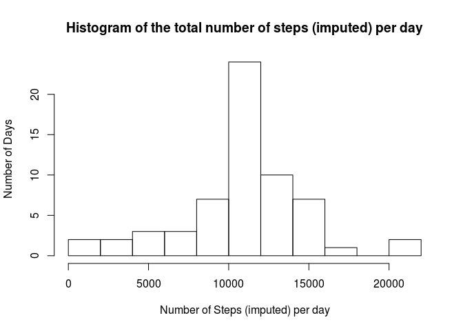
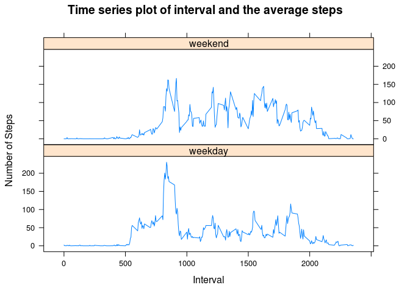

# Reproducible Research: Peer Assessment 1

## Introduction
This report is created as part of Peer Assessment 1 for the Coursera class [Reproduceable Research](https://class.coursera.org/repdata-031/) by Roger D. Peng, PhD, Jeff Leek, PhD, Brian Caffo, PhD. This assignment makes use of [Activity monitoring data](https://d396qusza40orc.cloudfront.net/repdata%2Fdata%2Factivity.zip). The dataset is stored in a comma-separated-value (CSV) file and there are a total of 17,568 observations in this dataset. 

The variables included in this dataset are:

* **steps**: Number of steps taking in a 5-minute interval (missing values are coded as NA)
* **date**: The date on which the measurement was taken in YYYY-MM-DD format
* **interval**: Identifier for the 5-minute interval in which measurement was taken

This reports answers the multiple parts of the assignment in the sections below.

## Setup the environment
Load the required libraries

```r
library(knitr)
library(lattice)
```
Since the requirement is to output all of the R code in the final report, set the global option of `echo = TRUE`

```r
opts_chunk$set(echo = TRUE, fig.path='figure/')
```

## Loading and preprocessing the data
Since the dataset is already part of our github repo, let's load it.

```r
unzip(zipfile = 'activity.zip', overwrite = TRUE)
activityData <- read.csv(file = 'activity.csv', header = TRUE)
```

Now, quickly confirm the structure of the dataset.

```r
str(activityData)
```

```
## 'data.frame':	17568 obs. of  3 variables:
##  $ steps   : int  NA NA NA NA NA NA NA NA NA NA ...
##  $ date    : Factor w/ 61 levels "2012-10-01","2012-10-02",..: 1 1 1 1 1 1 1 1 1 1 ...
##  $ interval: int  0 5 10 15 20 25 30 35 40 45 ...
```

```r
summary(activityData)
```

```
##      steps                date          interval     
##  Min.   :  0.00   2012-10-01:  288   Min.   :   0.0  
##  1st Qu.:  0.00   2012-10-02:  288   1st Qu.: 588.8  
##  Median :  0.00   2012-10-03:  288   Median :1177.5  
##  Mean   : 37.38   2012-10-04:  288   Mean   :1177.5  
##  3rd Qu.: 12.00   2012-10-05:  288   3rd Qu.:1766.2  
##  Max.   :806.00   2012-10-06:  288   Max.   :2355.0  
##  NA's   :2304     (Other)   :15840
```

This confirms that the dataset has 3 variables of steps, date and interval as stated in the introduction above.

Now, let's answer some questions.

## What is mean total number of steps taken per day?
1. Calculate the total number of steps taken per day ignoring the missing values

```r
nonNAStepData <- activityData[!is.na(activityData$steps),]
totalStepsPerDay <- aggregate(x = nonNAStepData$steps, by = list(nonNAStepData$date), FUN = sum, na.exclude = TRUE)
colnames(totalStepsPerDay) <- c('date', 'steps')
```

2. Make a histogram of the total number of steps taken each day

```r
hist(totalStepsPerDay$steps, breaks = 10, main = 'Histogram of the total number of steps per day', xlab = 'Number of Steps per day', ylab = 'Number of Days')
```

 


3. Calculate and report the mean and median of the total number of steps taken per day

```r
meanStepsPerDay <- mean(totalStepsPerDay$steps)
meanStepsPerDay
```

```
## [1] 10767.19
```

```r
medianStepsPerDay <- median(totalStepsPerDay$steps)
medianStepsPerDay
```

```
## [1] 10766
```


## What is the average daily activity pattern?
1. Time series plot (i.e. type = "l") of the 5-minute interval (x-axis) and the average number of steps taken, averaged across all days (y-axis)

```r
avgStepsPerInterval <- aggregate(x = nonNAStepData$steps, by = list(nonNAStepData$interval), FUN = mean, na.exclude = TRUE)
colnames(avgStepsPerInterval) <- c('interval', 'steps')

xyplot(as.numeric(avgStepsPerInterval$steps) ~ avgStepsPerInterval$interval, 
       type = "l", 
       main = "Time series plot of interval and the average steps", 
       xlab = "5-minute Interval",
       ylab = "Average number of Steps"
       )
```

 

2. Which 5-minute interval, on average across all the days in the dataset, contains the maximum number of steps?

```r
maxStepRow <- avgStepsPerInterval[order(avgStepsPerInterval$steps, decreasing = TRUE),][1,]
maxStepRow$interval
```

```
## [1] 835
```


## Imputing missing values
1. Calculate and report the total number of missing values in the dataset (i.e. the total number of rows with NAs)

```r
missingValuesCount <- length(activityData[is.na(activityData$steps),][,1])
missingValuesCount
```

```
## [1] 2304
```

2. A strategy for filling in all of the missing values in the dataset can be to use the mean for that 5-minute interval. So, a new dataset that is equal to the original dataset but with the missing data filled in can be calculated as below:

```r
imputedActivityData <- activityData
for (i in 1:nrow(imputedActivityData)) {
  if (is.na(imputedActivityData$steps[i])) {
    imputedActivityData$steps[i] <- avgStepsPerInterval$steps[avgStepsPerInterval$interval == imputedActivityData$interval[i]]
  }
}
```

3. Make a histogram of the total number of steps taken each day

```r
totalImputedStepsPerDay <- aggregate(x = imputedActivityData$steps, by = list(imputedActivityData$date), FUN = sum, na.exclude = TRUE)
colnames(totalImputedStepsPerDay) <- c('date', 'steps')
```

4. Make a histogram of the total number of steps taken each day

```r
hist(totalImputedStepsPerDay$steps, breaks = 10, main = 'Histogram of the total number of steps (imputed) per day', xlab = 'Number of Steps (imputed) per day', ylab = 'Number of Days')
```

 

5. Calculate and report the mean and median total number of steps taken per day. 

```r
meanImputedStepsPerDay <- mean(totalImputedStepsPerDay$steps)
meanImputedStepsPerDay
```

```
## [1] 10767.19
```

```r
medianImputedStepsPerDay <- median(totalImputedStepsPerDay$steps)
medianImputedStepsPerDay
```

```
## [1] 10767.19
```

6. Do these values differ from the estimates from the first part of the assignment? What is the impact of imputing missing data on the estimates of the total daily number of steps?

The difference of the imputed mean value from the estimates from the first part of the assignment is ```meanStepsPerDay - meanImputedStepsPerDay``` = ``0``

The difference of the imputed median value from the estimates from the first part of the assignment is ```medianStepsPerDay - medianImputedStepsPerDay``` = ``-1.2``


## Are there differences in activity patterns between weekdays and weekends?
1. Create a new factor variable in the dataset with two levels – “weekday” and “weekend” indicating whether a given date is a weekday or weekend day.

```r
imputedActivityData$dayType <- as.factor(sapply(imputedActivityData$date, function(date) {
  if(weekdays(as.Date(date)) %in% c("Saturday", "Sunday")) {
    "weekend"
  } else {
   "weekday"
  }
}))
```


2. Make a panel plot containing a time series plot (i.e. type = "l") of the 5-minute interval (x-axis) and the average number of steps taken, averaged across all weekday days or weekend days (y-axis).

```r
avgImputedStepsPerInterval <- aggregate(x = imputedActivityData$steps, by = list(interval = imputedActivityData$interval, dayType = imputedActivityData$dayType), FUN = mean)
colnames(avgImputedStepsPerInterval) <- c('interval', 'dayType', 'steps')

xyplot(as.numeric(avgImputedStepsPerInterval$steps) ~ avgImputedStepsPerInterval$interval | avgImputedStepsPerInterval$dayType, 
       type = "l", 
       layout=c(1, 2), 
       main = "Time series plot of interval and the average steps", 
       xlab = "Interval",
       ylab = "Number of Steps"
)
```

 

From the above plot one can understand that on weekdays the 5-minute intervals between 500 (5:00 am) and 1000 (10:00 am) have more steps than during the same time on weekends. This reflects that on weekdays the person starts his/her activities earlier than on weekend where they probably are sleeping in. ;-)

